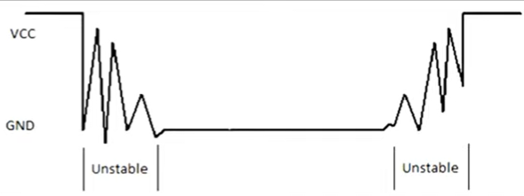

# Details
4x4 KeyPad
## Pins
4 output pins --> ROWS   
4 input pins --> COLUMNS
### power pins
output pins act as switches, when pushed it allows current to flow and send signal to input pins
### Control pins
input pins are (1111) by default, by controlling output pins we can switch an input pin to (0)

# Logic
## operation
- Pressing a button shorts one of the row lines to one of the column lines, allowing current to flow between them.
- when key ‘Button 1’ is pressed, column 1 and row 1 are shorted.
## search for a pressed key
- Ground all rows "output pins"
- Read all columns "input pins"
- if all columns=1, then no key pressed
- if one/more columns=0, then a key is pressed
-   - Ground first Row
    - Read all columns
    - Found key ? return its asci : check next row 
## key debounce
- Generating multiple signals as the contacts close or open "Transient for little time"
- So, we need to wait "delay" until it reaches a steady state

# Connections
4 rows (PA0-PA3)    
4 columns (PA4-PA7)

