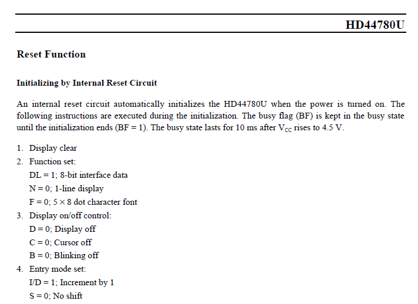
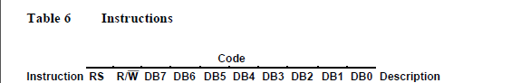
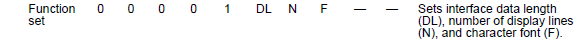
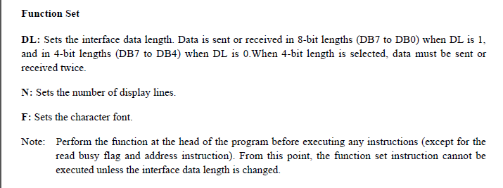
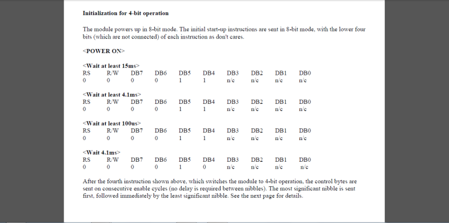

# Details
16 "characters" x 2 "lines" LCD     
5 "columns" x 7 "rows" dot matrix (for each character)
## Pins
The LCD has 16 pins
### power pins
VSS --> Ground     
VDD --> 5V     
VEE --> Control contrast "adjustable by pot"     
LEDA --> +ve supply of backlight    
LEDK --> -ve supply of backlight 
### Control pins
RS --> Register select (Command"Execute"/Data"Display")      
RW --> Read/Write      
E --> Enable
### Data pins
Transmit 4 or 8 bits of Command/Data

# Commands

We need 4 bit mode so make DL ‘0’. Thus the upper nibble of the command code is 0010b which is 0x02. If we need 2 lines we set N and the normal font so F is 0 thus lower nibble comes out to be 1000b i.e 0x08. Thus total command code is 0x28.   
Before sending this 0x28 we need to perform a specific initialization.

So we send 0x33 as the command code. This will do the initial 8 bit mode starting of LCD. Now after this we need to send 0x32.

# Registers
RS=0 -->select command register     
RS=1 -->selsct data register    
R/W=0 --> Write     
R/W=1 --> Read
E --> Enable    
D0-D7 --> Data Bus

